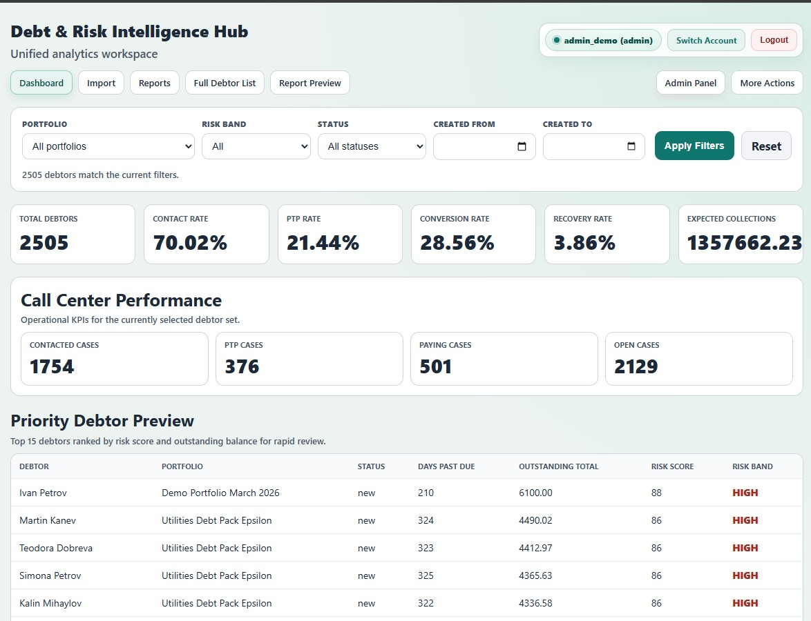
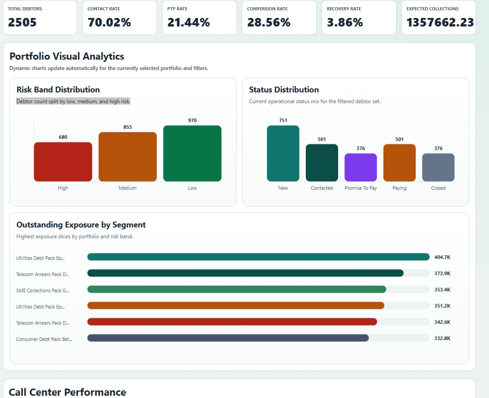
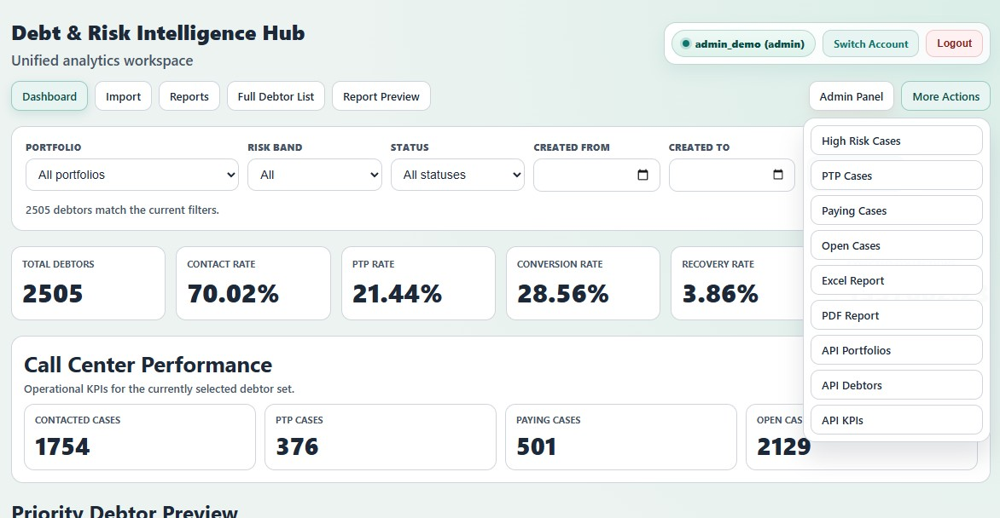
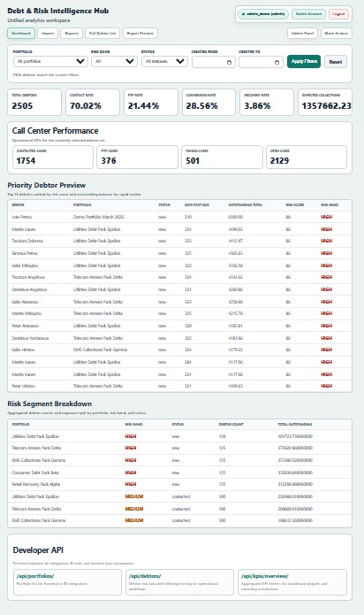
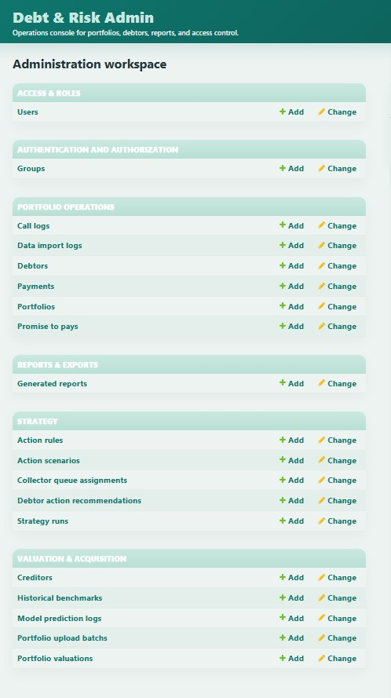

# Debt & Risk Intelligence Hub

Debt & Risk Intelligence Hub is a Django platform for debt portfolio analysis, risk scoring, call-center performance tracking, and management reporting.

It is designed as a portfolio-grade analytics product that demonstrates end-to-end delivery:
- ingestion and validation
- scoring engine
- dashboard analytics
- reporting exports
- REST APIs
- RBAC and CI

## Recruiter Snapshot
- Business use case: debt portfolio operations, collections analytics, and acquisition review
- End-to-end flow: `import -> validation -> scoring -> dashboard -> reports -> admin`
- V2 branch adds: `valuation -> benchmark fallback -> scenario analysis -> comparison desk -> ML baseline scaffold`
- Built with: Django, DRF, SQLite (demo/dev), openpyxl, reportlab
- Includes: dynamic charts, API layer, role-based access, tests, CI
- Reporting currency for demo data: `EUR`

## Live Demo
- App: https://debt-risk-intelligence-hub.onrender.com
- Public demo accounts:
  - `manager_demo / DemoPass123!`
  - `analyst_demo / DemoPass123!`
- Note: the free Render instance may take a short time to wake up after inactivity.
- If the live demo is unavailable, screenshots and local setup instructions are available below.

## Product Tour
Open the app locally and review it in this order:
1. Dashboard: KPI cards, portfolio filters, charts, debtor preview
2. Full Debtor List: sortable and paginated operational view
3. Report Preview: Excel/PDF-ready management reporting
4. Valuation Workspace (V2 branch): portfolio ranking, recommendation actions, and benchmark-aware acquisition review
5. Portfolio Comparison Desk (V2 branch): side-by-side acquisition comparison for multiple packages
6. Admin Panel: portfolio, debtor, report, and access management

## Business Problem
Debt operations teams often work with fragmented CSV/Excel exports, ad-hoc scoring logic, and delayed performance visibility.

This project centralizes those workflows into one system that supports:
- portfolio-level visibility
- debtor prioritization
- KPI monitoring
- repeatable management reporting

## Core Features
- CSV/Excel import with required-column validation, row-level errors, preview before save
- Baseline rule-based risk scoring (`risk_score`, `risk_band`, reason factors)
- REST API for portfolios, debtors, risk details, and KPI overview
- Management dashboard with filters, KPI cards, dynamic visual analytics, and segment breakdowns
- Performance module (`contact_rate`, `ptp_rate`, `conversion_rate`, `recovery_rate`)
- Excel and PDF management report exports
- Weekly report generation command
- Role-based access control (Analyst / Manager / Admin)
- GitHub Actions CI pipeline
- Demo portfolios standardized to `EUR` as the reporting currency

## V2 Acquisition Intelligence Layer
Available on the `feature/valuation-v2` branch:
- Portfolio valuation workspace with attractiveness ranking and recommendation actions (`Bid / Hold / Reject`)
- Rule-based pricing engine with benchmark and similarity fallback
- Scenario analysis for multiple bid levels (`6% / 8% / 10% / 12%`)
- Acquisition import flow for new debtor packages
- Historical benchmark management workspace
- Valuation memo preview with Excel/PDF exports
- ML-ready feature engineering layer
- ML baseline forecast scaffold with prediction logging
- Portfolio comparison desk for side-by-side acquisition review

## Why This Project Stands Out
- Solves a real operations problem instead of acting like a generic CRUD demo
- Combines backend workflows, analytics UI, reporting, and admin operations in one product
- Shows product thinking: role-based access, validation, reporting flow, and recruiter-friendly demo data
- Exposes a clean API layer, which makes the app BI-ready for tools like Power BI or Tableau

## Tech Stack
- Python 3.13
- Django 5
- Django REST Framework
- SQLite (local/dev)
- openpyxl (Excel)
- reportlab (PDF)

## Project Structure
- `apps/users` - custom user model, roles, RBAC helpers
- `apps/portfolio` - debt domain models, import flow, APIs
- `apps/scoring` - baseline scoring service
- `apps/dashboard` - management dashboard views/templates
- `apps/reports` - report services, exports, scheduled command
- `apps/valuation` - acquisition pricing, benchmarks, scenario analysis, comparison desk, ML baseline scaffold
- `docs/` - demo/testing walkthrough

## Local Setup
1. `python -m venv .venv`
2. `\.venv\Scripts\Activate.ps1`
3. `pip install -r requirements.txt`
4. `python manage.py migrate`
5. `python manage.py seed_demo_data`
6. `python manage.py runserver`

Demo note: sample portfolios are normalized to `EUR` for consistent KPI and reporting output.

## Quick Demo Flow
If someone opens the repo and wants to understand the product quickly:
1. Run the app locally
2. Log in with `manager_demo / DemoPass123!`
3. Open `/dashboard/`
4. Change the portfolio filter and review how KPI cards and charts update
5. Open `Full Debtor List`
6. Open `Report Preview`
7. Switch to the `feature/valuation-v2` branch and open `/valuation/`
8. Review the ranking workspace, comparison desk, and valuation preview
9. Log in as a private admin user and open `/admin/`

## Demo Accounts
- Public demo accounts:
  - `manager_demo / DemoPass123!`
  - `analyst_demo / DemoPass123!`
- Private admin access is reserved for controlled demos.

## Demo Role Access

### analyst_demo / DemoPass123!
Allowed:
- `/api/portfolios/`
- `/api/debtors/`

Restricted (friendly access message shown):
- `/dashboard/`
- `/api/kpis/overview/`
- `/reports/management/` (including Excel/PDF downloads)

### manager_demo / DemoPass123!
Allowed:
- `/dashboard/`
- `/api/kpis/overview/`
- `/reports/management/` + Excel/PDF download
- `/api/portfolios/`
- `/api/debtors/`

Typical use: operations/management workflow.

### Private admin access
Allowed:
- Everything available to `manager_demo`
- Django admin panel: `/admin/`
- Full admin privileges (`is_staff` + `is_superuser`)

## Main URLs
- Root (redirects to dashboard): `http://127.0.0.1:8000/`
- Dashboard: `http://127.0.0.1:8000/dashboard/`
- Data import: `http://127.0.0.1:8000/portfolio/import/`
- Full debtor list: `http://127.0.0.1:8000/dashboard/debtors/`
- Report preview: `http://127.0.0.1:8000/reports/management/`
- Valuation workspace (V2 branch): `http://127.0.0.1:8000/valuation/`
- Portfolio comparison desk (V2 branch): `http://127.0.0.1:8000/valuation/compare/`
- API portfolios: `http://127.0.0.1:8000/api/portfolios/`
- API debtors: `http://127.0.0.1:8000/api/debtors/`
- API KPI overview: `http://127.0.0.1:8000/api/kpis/overview/`
- Django admin: `http://127.0.0.1:8000/admin/`

## Reports
- Excel export: `/reports/management/excel/`
- PDF export: `/reports/management/pdf/`
- Weekly summary command: `python manage.py generate_weekly_reports`

## API Overview
- `GET /api/portfolios/`
- `GET /api/debtors/`
- `GET /api/debtors/<id>/score/`
- `GET /api/kpis/overview/`

Query examples:
- `/api/debtors/?risk_band=high&ordering=-outstanding_total`
- `/api/debtors/?search=Petrov&min_score=60`

## Testing
- Full suite: `python manage.py test --verbosity 1`
- Targeted suites:
  - `python manage.py test apps.portfolio.tests apps.portfolio.tests_importers`
  - `python manage.py test apps.dashboard.tests`
  - `python manage.py test apps.reports.tests`
  - `python manage.py test apps.scoring.tests`
  - `python manage.py test apps.valuation.tests`

## CI
GitHub Actions workflow:
- installs dependencies
- runs `python manage.py check`
- runs migrations
- runs all tests

Workflow file: `.github/workflows/ci.yml`

## Demo Walkthrough
See `docs/demo_checklist.md` for a step-by-step localhost QA flow.

## Current Status
Stable on `main`:
- data import + validation + preview + persistence
- risk scoring engine v1
- API layer
- dashboard + performance module + dynamic portfolio charts
- reporting exports + weekly command
- RBAC
- CI and tests

In progress on `feature/valuation-v2`:
- acquisition intelligence workspace
- valuation ranking and recommendation actions
- benchmark and similarity fallback
- scenario analysis and valuation memo exports
- ML baseline forecast scaffold
- portfolio comparison desk

Planned next:
- V2 screenshots and demo polish
- optional training dataset ingestion path
- merge decision once V2 is presentation-ready
- import column mapping and normalization layer for heterogeneous source files

## UI Preview

### Dashboard Overview
Main management workspace with KPI cards, compact filters, quick navigation, dynamic charts, and portfolio-wide debt monitoring.

### Dashboard Charts
Dedicated analytics section with three dynamic visualizations that react to the selected debtor package and active filters.
- `Risk Band Distribution`: shows how the filtered debtors are split across `high`, `medium`, and `low` risk.
- `Status Distribution`: shows the operational mix across `new`, `contacted`, `promise_to_pay`, `paying`, and `closed` cases.
- `Outstanding Exposure by Segment`: highlights the highest-exposure portfolio/risk slices, limited to `Top 5 + Others` when all portfolios are selected.

### Dashboard Actions
Top navigation and filter toolbar designed for one-click access to reporting, debtor lists, admin workflows, and live chart updates.

### Dashboard Focus
Detailed operational view showing performance KPIs, dynamic visual analytics, priority debtor preview, and risk segment breakdowns in one screen.

### Admin Workspace
Lightly branded Django admin console for portfolios, debtors, reports, and role-based access management.

## How The Charts Work
- `Risk Band Distribution` updates from the currently filtered debtor set and shows how cases split across `high`, `medium`, and `low` risk.
- `Status Distribution` reflects the live operational mix for the filtered population.
- `Outstanding Exposure by Segment` ranks the highest monetary exposure slices.
- When all portfolios are selected, the exposure chart uses `Top 5 + Others` to stay readable.
- When a single portfolio is selected, the exposure chart focuses only on that portfolio's segments.

## Developer API Preview

### Portfolios Endpoint

### Debtors Endpoint

### KPI Overview Endpoint

