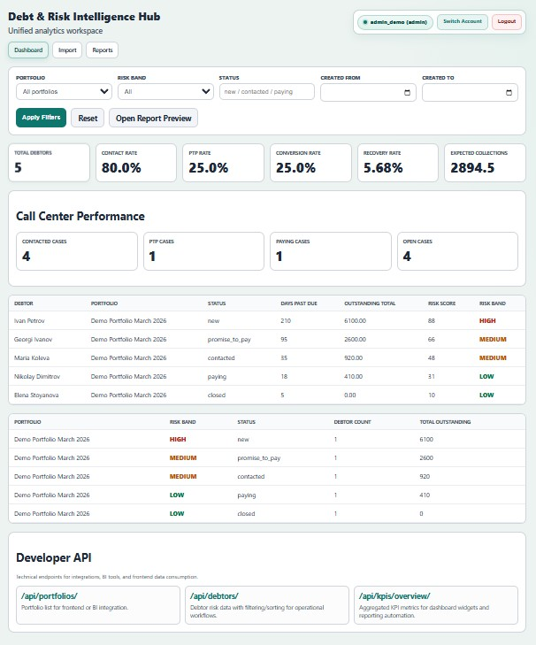
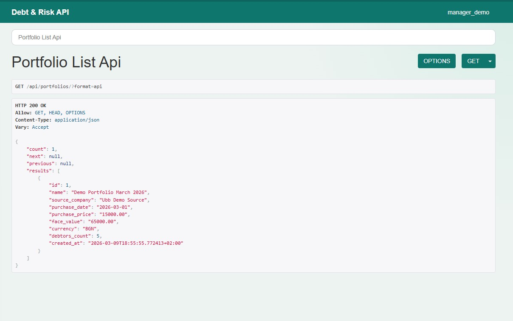
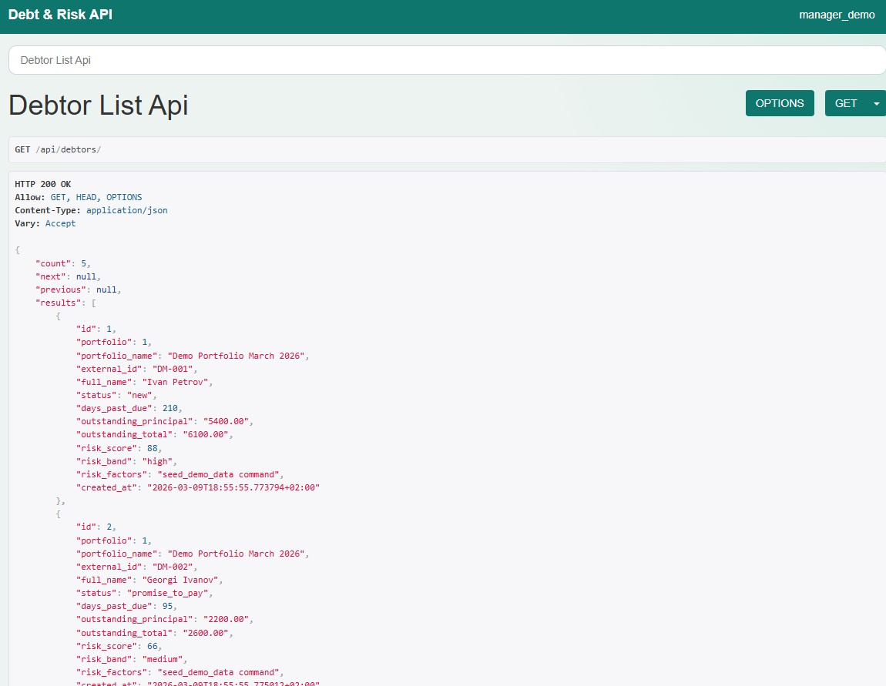
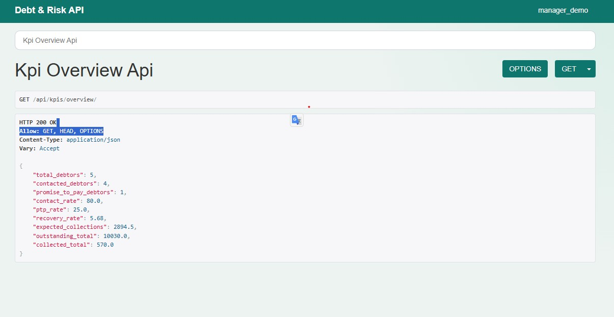

# Debt & Risk Intelligence Hub

Debt & Risk Intelligence Hub is a Django platform for debt portfolio analysis, risk scoring, call-center performance tracking, and management reporting.

It is designed as a portfolio-grade product that demonstrates end-to-end delivery:
- ingestion and validation
- scoring engine
- APIs
- dashboard analytics
- report generation
- RBAC and CI

## Business Problem
Debt operations teams often work with fragmented CSV/Excel exports, ad-hoc scoring logic, and delayed performance visibility.

This project centralizes those workflows into one system that supports:
- portfolio-level visibility
- debtor prioritization
- KPI monitoring
- repeatable management reporting

## Core Features
- CSV/Excel import with required-column validation, row-level errors, preview before save
- Baseline rule-based risk scoring (`risk_score`, `risk_band`, reason factors)
- REST API for portfolios, debtors, risk details, and KPI overview
- Management dashboard with filters, KPI cards, and segment breakdowns
- Performance module (`contact_rate`, `ptp_rate`, `conversion_rate`, `recovery_rate`)
- Excel and PDF management report exports
- Weekly report generation command
- Role-based access control (Analyst / Manager / Admin)
- GitHub Actions CI pipeline

## Tech Stack
- Python 3.13
- Django 5
- Django REST Framework
- SQLite (local/dev)
- openpyxl (Excel)
- reportlab (PDF)

## Project Structure
- `apps/users` - custom user model, roles, RBAC helpers
- `apps/portfolio` - debt domain models, import flow, APIs
- `apps/scoring` - baseline scoring service
- `apps/dashboard` - management dashboard views/templates
- `apps/reports` - report services, exports, scheduled command
- `docs/` - demo/testing walkthrough

## Local Setup
1. `python -m venv .venv`
2. `.\.venv\Scripts\Activate.ps1`
3. `pip install -r requirements.txt`
4. `python manage.py migrate`
5. `python manage.py seed_demo_data`
6. `python manage.py runserver`

## Demo Accounts
- `manager_demo / DemoPass123!`
- `analyst_demo / DemoPass123!`
- `admin_demo / DemoPass123!`

## Demo Role Access

### analyst_demo / DemoPass123!
Allowed:
- `/api/portfolios/`
- `/api/debtors/`

Restricted (friendly access message shown):
- `/dashboard/`
- `/api/kpis/overview/`
- `/reports/management/` (including Excel/PDF downloads)

### manager_demo / DemoPass123!
Allowed:
- `/dashboard/`
- `/api/kpis/overview/`
- `/reports/management/` + Excel/PDF download
- `/api/portfolios/`
- `/api/debtors/`

Typical use: operations/management workflow.

### admin_demo / DemoPass123!
Allowed:
- Everything available to `manager_demo`
- Django admin panel: `/admin/`
- Full admin privileges (`is_staff` + `is_superuser`)

## Main URLs
- Root (redirects to dashboard): `http://127.0.0.1:8000/`
- Dashboard: `http://127.0.0.1:8000/dashboard/`
- Data import: `http://127.0.0.1:8000/portfolio/import/`
- Report preview: `http://127.0.0.1:8000/reports/management/`
- API portfolios: `http://127.0.0.1:8000/api/portfolios/`
- API debtors: `http://127.0.0.1:8000/api/debtors/`
- API KPI overview: `http://127.0.0.1:8000/api/kpis/overview/`
- Django admin: `http://127.0.0.1:8000/admin/`

## Reports
- Excel export: `/reports/management/excel/`
- PDF export: `/reports/management/pdf/`
- Weekly summary command: `python manage.py generate_weekly_reports`

## RBAC Matrix
- Analyst:
  - allowed: portfolio/debtor APIs
  - restricted: dashboard, KPI overview API, report downloads (friendly access message)
- Manager:
  - allowed: dashboard, KPI overview API, report downloads, portfolio/debtor APIs
- Admin:
  - manager access + admin capabilities

## API Overview
- `GET /api/portfolios/`
- `GET /api/debtors/`
- `GET /api/debtors/<id>/score/`
- `GET /api/kpis/overview/`

Query examples:
- `/api/debtors/?risk_band=high&ordering=-outstanding_total`
- `/api/debtors/?search=Petrov&min_score=60`

## Testing
- Full suite: `python manage.py test --verbosity 1`
- Targeted suites:
  - `python manage.py test apps.portfolio.tests apps.portfolio.tests_importers`
  - `python manage.py test apps.dashboard.tests`
  - `python manage.py test apps.reports.tests`
  - `python manage.py test apps.scoring.tests`

## CI
GitHub Actions workflow:
- installs dependencies
- runs `python manage.py check`
- runs migrations
- runs all tests

Workflow file: `.github/workflows/ci.yml`

## Demo Walkthrough
See `docs/demo_checklist.md` for a step-by-step localhost QA flow.

## Current Status
Implemented:
- data import + validation + preview + persistence
- risk scoring engine v1
- API layer
- dashboard + performance module
- reporting exports + weekly command
- RBAC
- CI and tests

Planned next:
- deployment configuration (Render)
- short product demo capture

## UI Preview

### Dashboard

## Developer API Preview

### Portfolios Endpoint

### Debtors Endpoint

### KPI Overview Endpoint

